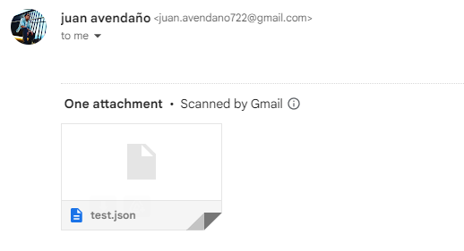
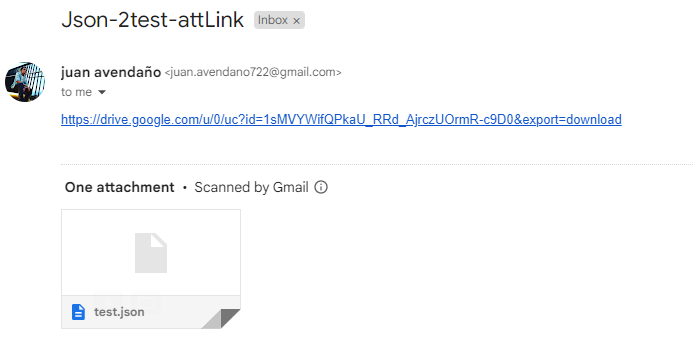

## Description

This API, built with Nest.js, facilitates the conversion and mapping of JSON data. The first step involves defining a TypeScript class, MappedResponse, which represents the desired structure for the output JSON. The class-transformer library is then utilized to seamlessly map the input JSON to an instance of the defined class. A dedicated controller endpoint, /json-mapper/map-data, receives the initial JSON data, performs the mapping operation, and returns the transformed JSON adhering to the structure defined by the MappedResponse class.

Furthermore, the API demonstrates the integration of Nest.js with the mail-parser library to parse the content of emails with attachments. Another controller endpoint is created, expecting the URL or path of an email file as a parameter. This endpoint processes the email content, extracts the attached JSON file, and responds with the parsed JSON. The solution accommodates various scenarios, including JSON attachments, links within the email body, or links leading to a webpage containing the JSON link, showcasing the versatility of Nest.js for handling complex tasks like email parsing and JSON processing.

## Installation

1. Start with node package
```
$ npm install
```
2. start the server
```
$ npm run start:dev
```
## Observations
This works just on localhost:3000, there is a simulation of the web page por the 2 endpoint third case, so it has to be in this port.


## PostmanCollection: 
 https://interstellar-crescent-253112.postman.co/workspace/dfsdf~ab9a2158-73df-4e5c-ad1b-833cc6d3ba62/collection/24745741-e2d112db-1dda-4523-b03c-86089d9da801?action=share&creator=24745741

## Explanation endpoints

1. POST => localhost:3000/json-mapper/map-data
Body: JSON data
Return: JSON data transformed


It is designed to receive JSON data in the request body. The incoming JSON, denoted as jsonData, is passed as a parameter to the mapData method. This method, in turn, delegates the mapping operation to an instance of the JsonMapperService class, which encapsulates the logic for transforming the input JSON into a structured format defined by the MappedResponse class.

The JsonMapperService utilizes custom logic to map specific properties from the input JSON to corresponding fields within the MappedResponse class. Once the mapping process is complete, the transformed data, now conforming to the MappedResponse structure, is returned as the response to the client. In summary, this endpoint serves as an intermediary for mapping JSON data through the JsonMapperService, providing a standardized and structured representation in the form of a MappedResponse.

2. POST => localhost:3000/email/parse-json
Body: email file name with .eml, 
    1. { "mail":"test1-att.eml"}.
    
    2. { "mail":"test2-link.eml"}
    
    3. {"mail":"testing-3.eml"}
    

- File .eml are found on emails folder in the source path.
- For 2 and 3 points is mandatory to provide a direct dowload link to get the JSON.


The getJsonFromEmail endpoint in the MailparserController of this Nest.js application serves as an interface for parsing JSON data from email attachments. Utilizing the mail-parser library, the associated MailparserService encapsulates the intricate logic involved in handling various scenarios. The endpoint, accessible at '/email/parse-json', expects the filename of an email file as a parameter in the request body. It then invokes the parseEmailAttached method in the MailparserService.

This service, designed to handle errors gracefully, retrieves the content of the specified email file, processes it, and extracts the JSON data. Depending on the email's structure, the service identifies whether the JSON is attached as a file or embedded as a link within the email body. It then performs the necessary operations, such as parsing the JSON content or fetching the JSON data from a URL, and returns the processed JSON data. The service's robust error-handling mechanisms ensure that any encountered issues are appropriately logged and result in the corresponding HTTP error responses. Overall, this endpoint facilitates dynamic extraction of JSON data from emails, accommodating diverse email structures and attachment scenarios.

